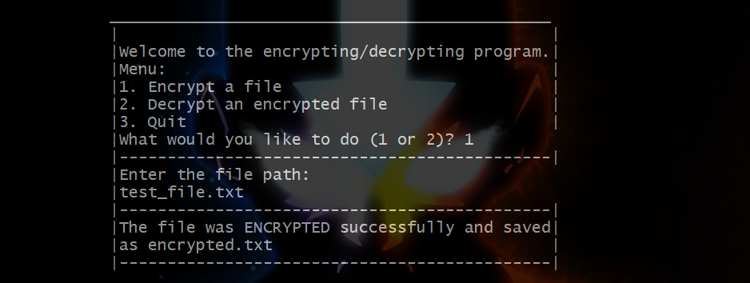
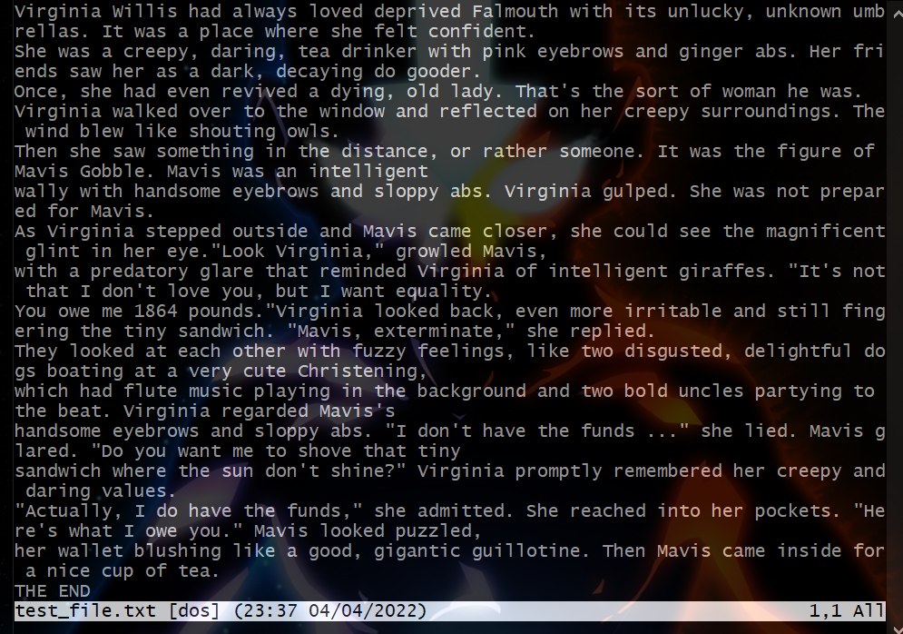
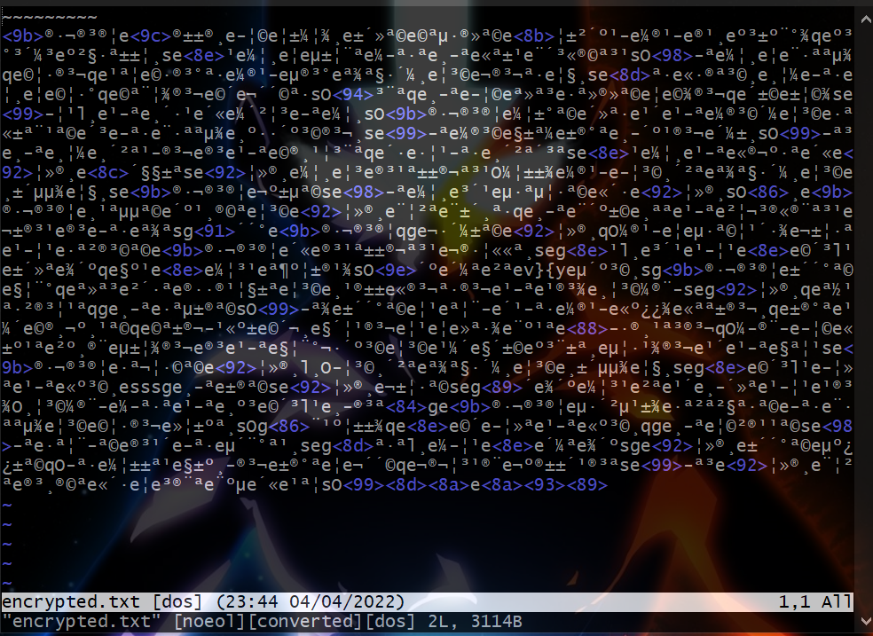
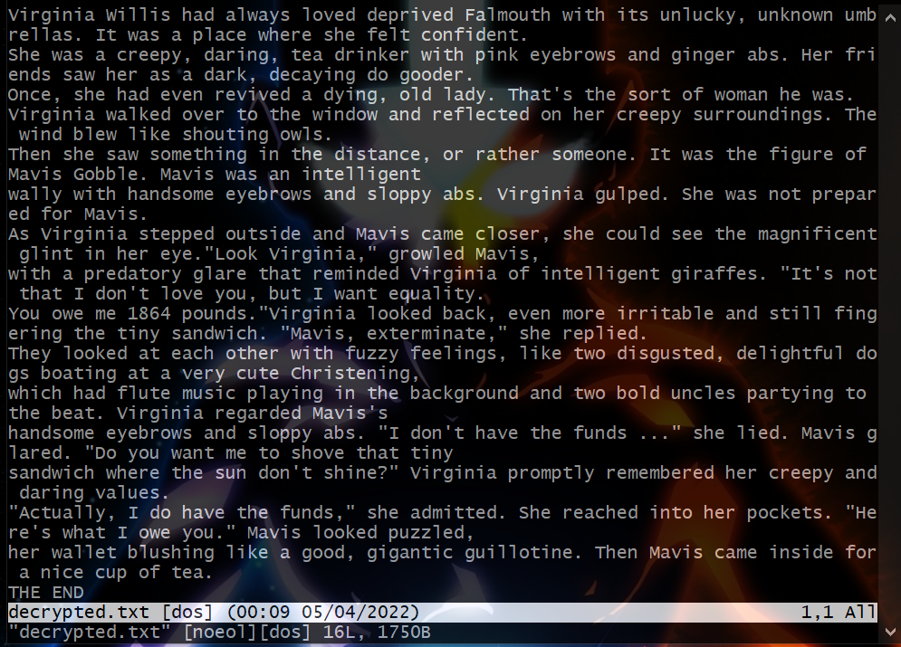

<h4>DISCLAIMER: THIS PROGRAM SHOULD NOT BE USED WITH FILES CONTAINING SENSITIVE   
INFORMATION. NO SOPHISTICATED FORM OF ENCRYPTION WAS USED HERE. </h4>  
  
**_Side note_**: Below all the print statements, I had to flush the buffer with `fflush(stdout)` so the program would work correctly with unix environments, specifically git bash. If anyone knows how to avoid using those, feel free to make a pull request, thank you.  

Run `main.c` with:

**Unix based systems:** `clear && g++ main.c && ./a.exe`  
**Windows:** `cls && g++ main.c && a.exe`  
Replace `g++` with the c/c++ compiler you have.
  
  
  
  
<h2>Sample encryption:</h2>  

File to encrypt -> `test_file.txt`:  
  
Encrypted file -> `encrypted.txt`:    
  
  
<h2>Sample decryption:</h2>  

After decrypting `encrypted.txt`, the output will be stored in `decrypted.txt`:  
  
  
`test_file.txt` was generated with https://www.plot-generator.org.uk/
